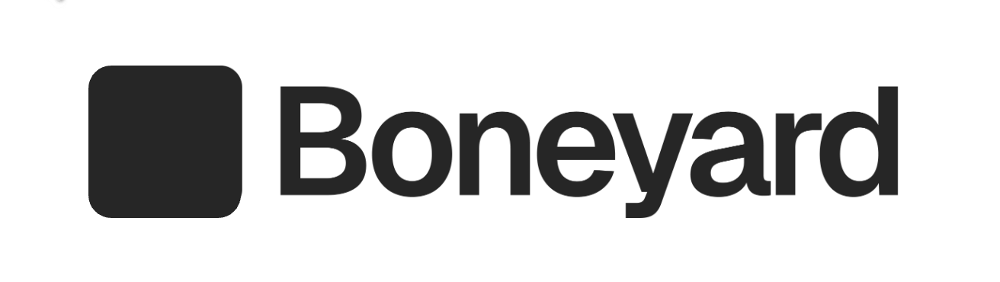

<p align="center">
  
</p>

# boneyard

Pixel-perfect skeleton loading screens, extracted from your real DOM. No manual measurement, no hand-tuned placeholders.

## How it works

1. Wrap your component with `<Skeleton>` and give it a name
2. Run `npx boneyard-js build` — it snapshots the DOM and generates bones
3. Import the registry once — every skeleton auto-resolves

```tsx
import { Skeleton } from 'boneyard-js/react'

function BlogPage() {
  const { data, isLoading } = useFetch('/api/post')

  return (
    <Skeleton name="blog-card" loading={isLoading}>
      {data && <BlogCard data={data} />}
    </Skeleton>
  )
}
```

```bash
npx boneyard-js build
```

```tsx
// app/layout.tsx — add once
import './bones/registry'
```

Done. Every `<Skeleton name="...">` shows a pixel-perfect skeleton on load.

## Install

```bash
npm install boneyard-js
```

## What it does

- Reads `getBoundingClientRect()` on every visible element in your component
- Stores positions as a flat array of `{ x, y, w, h, r }` bones
- Renders them as gray rectangles that match your real layout exactly
- Responsive — captures at multiple breakpoints (375px, 768px, 1280px by default)
- Pulse animation shimmers to a lighter shade of whatever color you set

## Props

| Prop | Type | Default | Description |
|------|------|---------|-------------|
| `name` | string | required | Unique name for this skeleton |
| `loading` | boolean | required | Show skeleton or real content |
| `color` | string | `#e0e0e0` | Bone fill color |
| `animate` | boolean | `true` | Pulse animation |
| `snapshotConfig` | object | — | Control which elements are included |

## CLI

```bash
npx boneyard-js build                    # auto-detect dev server
npx boneyard-js build http://localhost:3000
npx boneyard-js build --breakpoints 390,820,1440 --out ./public/bones
```

## Links

- [npm](https://www.npmjs.com/package/boneyard-js)
- [Documentation](https://github.com/0xGF/boneyard)

## License

MIT
